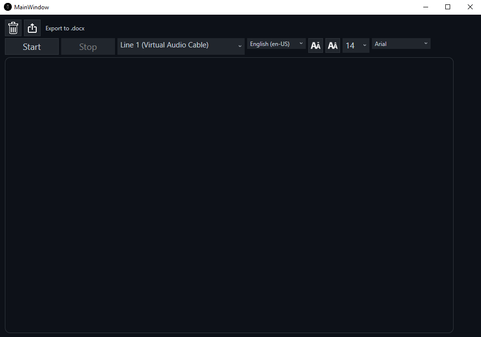

# Speech-Recognition-App
This program is designed to recognize human speech and convert it into text in real time. The speech recognition logic is implemented using the speech_recognition library in Python. To achieve acceptable operation of this library when continuously listening to an audio stream, some improvements were applied related to the ability to work in multiple threads. Also, for more convenient interaction with the Python script, a WPF program was created that acts as a “visual shell” for the user. The program has the ability to work not only with the user’s microphone, but also with almost any audio device in his system, but to capture audio from third-party applications, it is recommended to use a virtual audio cable.

The WPF program uses the following NuGet packages:
1. DocumentFormat.OpenXml
2. NAudio.WaveFormRenderer
3. System.Drawing.Common
4. NAudio.Core
5. Cake.Core

P.S if your audio devices are not displayed in the drop-down list, then click on the Start button, then close the program and open it again.
